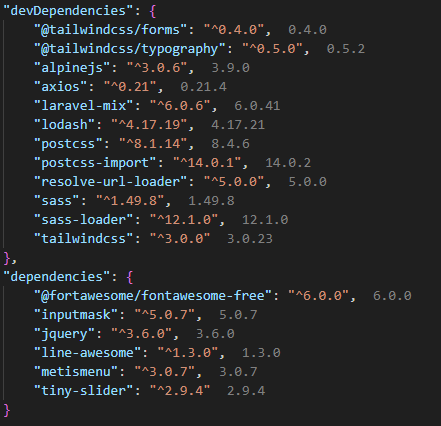

# VSCode package manager intellisense

This extensions shows you versions of your installed packages.

Packages installed versions hint

## Installation
- Open VS Code and click on Extensions Icon in the Activity Bar.
- Type `faissaloux.package-manager-intellisense`.
- Install.

## Supported Package Managers
- npm
- yarn
- pnpm

## Usage
- Install your packages using `npm`, `yarn` or `pnpm`.
- Open your `package.json` file.
- Installed versions gonna be displayed to you.

**Enjoy!**
