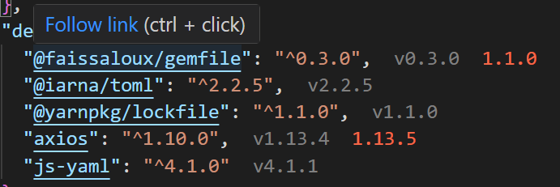
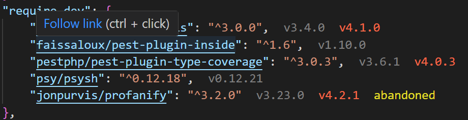
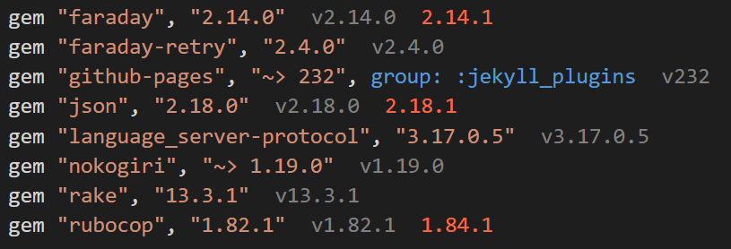
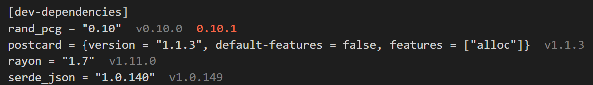

# VSCode package manager intellisense

Extension that shows you versions of your installed packages, and allow you to go to their links by clicking on them.

##### Javascript

##### php

##### ruby

##### rust

## Installation
- Open VS Code and click on Extensions Icon in the Activity Bar.
- Type `faissaloux.package-manager-intellisense`.
- Install.

## Supported Package Managers
- npm
- yarn
- pnpm
- bun
- composer
- bundler
- cargo

### Links support
- npm
- yarn
- pnpm
- bun
- composer

## Usage
- Install your packages using `npm`, `yarn`, `pnpm`, `bun`, `composer`, `bundler` or `cargo`.
- Open your `package.json`, `composer.json`, `Gemfile` or `Cargo.toml` file.
- Installed versions gonna be displayed to you.

**Enjoy!**
