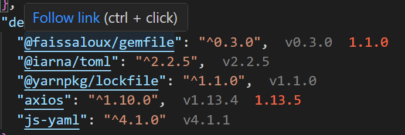
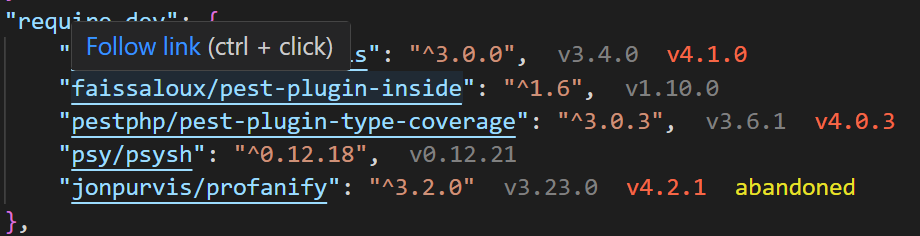
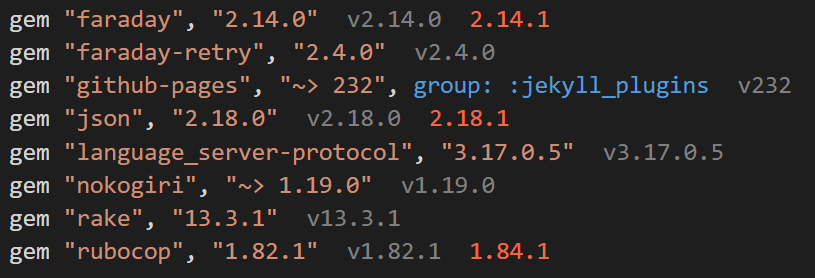
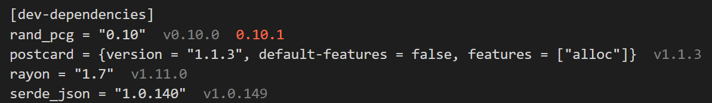
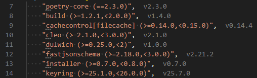
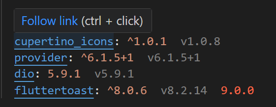

# VSCode package manager intellisense

Extension that shows you versions of your installed packages, latest available versions and allow you to go to their links by clicking on them.

#### Legend
_gray:_ installed version.\
_red:_ latest available version.

    
javascript

    

    
php

    

    
ruby

    

    
rust

    

    
python

    

    
dart

    

## Installation
- Open VS Code and click on Extensions Icon in the Activity Bar.
- Type `faissaloux.package-manager-intellisense`.
- Install.

## Support

| Package Manager | installed versions | latest versions | links |
---|---|---|---|
| npm | ✔️ | ✔️ | ✔️ |
| yarn | ✔️ | ✔️ | ✔️ |
| pnpm | ✔️ | ✔️ | ✔️ |
| bun | ✔️ | ✔️ | ✔️ |
| composer | ✔️ | ✔️ | ✔️ |
| bundler | ✔️ | ✔️ | ❌ |
| cargo | ✔️ | ✔️ | ❌ |
| poetry | ✔️ | ✔️ | ❌ |
| pub | ✔️ | ✔️ | ✔️ |

## Usage
- Install your dependencies.
- Open your dependencies file.
- See more informations about your dependencies.

**Enjoy!**
