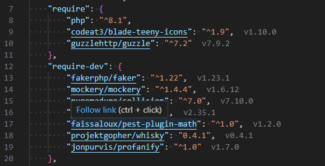
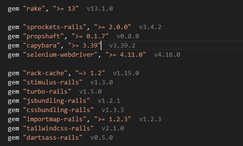

# VSCode package manager intellisense

Extension that shows you versions of your installed packages.

## Installation
- Open VS Code and click on Extensions Icon in the Activity Bar.
- Type `faissaloux.package-manager-intellisense`.
- Install.

## Supported Package Managers
- npm
- yarn
- pnpm
- composer
- bundler

## Usage
- Install your packages using `npm`, `yarn`, `pnpm`, `composer` or `bundler`.
- Open your `package.json`, `composer.json` or `Gemfile` file.
- Installed versions gonna be displayed to you.

**Enjoy!**
